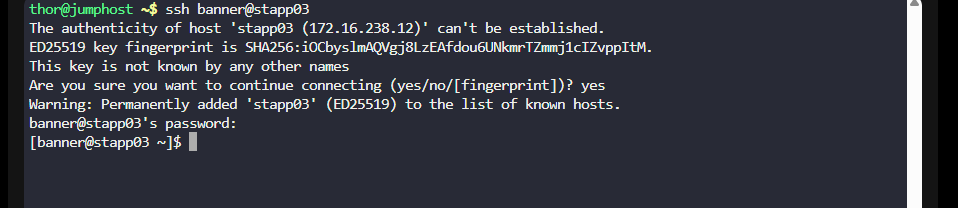
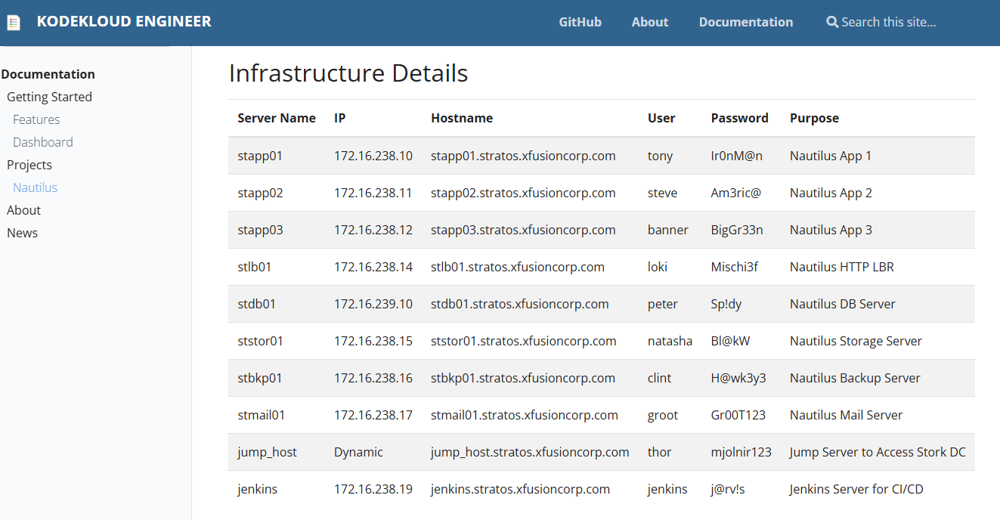
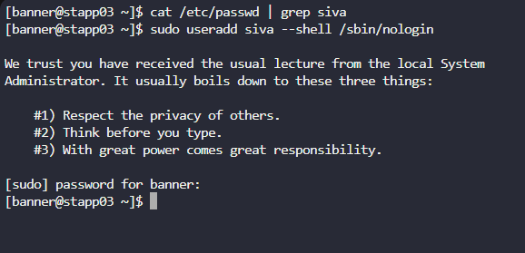
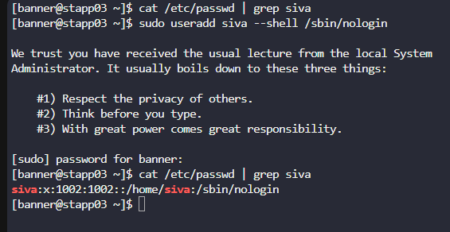

# Temporary User Creation with Expiry

### KodeKloud – 100 Days of DevOps Challenge

---

## 📌 Project Overview

In modern infrastructure environments, managing **temporary user access** is an important part of maintaining security and compliance. Temporary accounts are often required for developers, contractors, or support engineers who need limited-time access to servers.

As part of the **KodeKloud 100 Days of DevOps Challenge**, this task focuses on creating a **temporary Linux user account** with a predefined **expiry date**. Once the expiry date is reached, the account becomes inactive automatically, preventing unauthorized access.

This task was completed on **App Server 2** in the Nautilus project infrastructure.

---

## 🎯 Objective

The objective of this task is to:

* Create a **temporary user account** for a developer.
* Ensure the account automatically **expires on a specified date**.
* Verify the account configuration to ensure compliance with the requirement.

This type of configuration helps organizations follow **security best practices**, particularly the **principle of least privilege** and **time-bound access control**.

---

## 🏗️ Infrastructure Details

| Parameter     | Value                             |
| ------------- | --------------------------------- |
| Environment   | Nautilus Project Lab              |
| Server Name   | stapp03                           |
| Server Role   | App Server 3                      |
| Hostname      | `stapp03.stratos.xfusioncorp.com` |
| Target User   | `siva`                             |
| Expiry Date   | `2027-03-28`                      |
| Access Method | SSH                               |

---

## 🔐 Why User Expiry is Important

Setting an expiry date on user accounts helps to:

* Prevent **unused accounts from remaining active**
* Reduce **security risks from forgotten credentials**
* Improve **access management and auditing**
* Enforce **temporary developer or contractor access policies**

In production environments, many companies integrate this approach with **identity management systems** and **automation tools**.

---

## 💻 Implementation Steps

### Step 1: Connect to the App Server

First, connect to **App Server 3** using SSH.


```bash
ssh banner@172.16.238.12 or ssh banner@stapp3
```

After successful authentication, you will gain access to the remote Linux server where the user account will be created.





---

### Step 2: Create the Temporary User

Before creating a user, always check if it already exists:

```bash
cat /etc/passwd | grep siva
```
No output confirms the user does not exist.
Then, create the user siva with no login shell

```bash
sudo useradd --shell /sbin/nologin siva
```




### Explanation

| Parameter    | Meaning                                        |
| ------------ | ---------------------------------------------- |
| `sudo`       | Run the command with administrative privileges |
| `useradd`    | Command used to create new users               |
| `-shell /sbin/nologin`| Set login shell to /sbin/nologin to prevent interactive login|
| `siva`        | Username to be created                         |

After this command executes successfully, the user account will be created and configured with the specified expiry date.

---

### Step 3: Verify the User Configuration

To confirm that the expiry date has been set correctly, use the following command:

```bash
cat /etc/passwd | grep siva
```

This command displays the **account aging information** for the user.

---

## 📊 Example Output

Example output of the verification command:

```
siva:x:1002:1002: : /home/siva: /sbin/nologin
```


---

## ✅ Result

The task was successfully completed.

---

## 📚 Learning Outcome

From completing this task, the following Linux administration skills were practiced:

* Managing Linux users
* Configuring account expiration
* Verifying account aging settings
* Working with remote servers via SSH

These skills are fundamental for **System Administrators**, **DevOps Engineers**, and **Cloud Engineers**.

---

